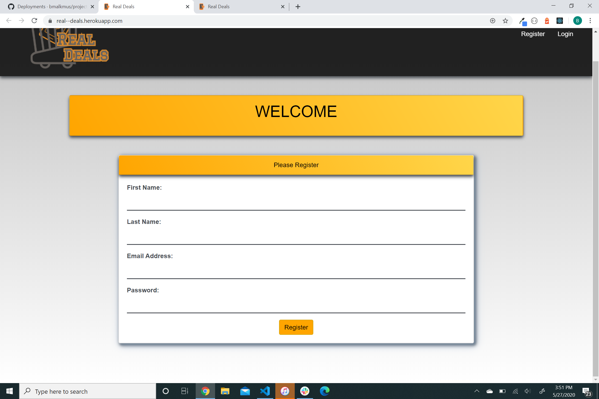
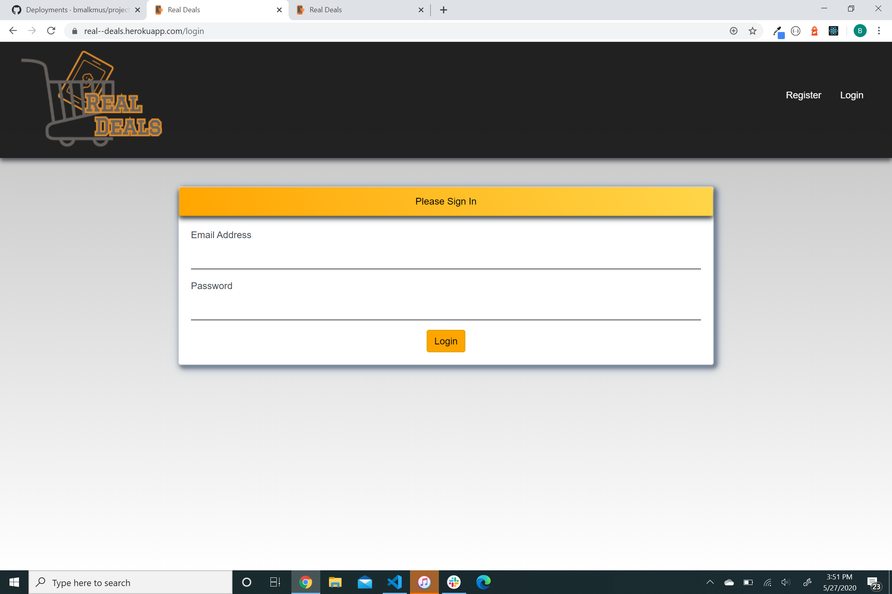
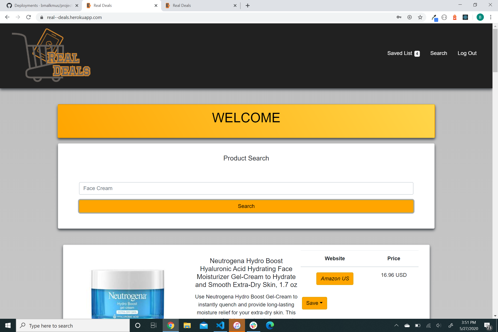
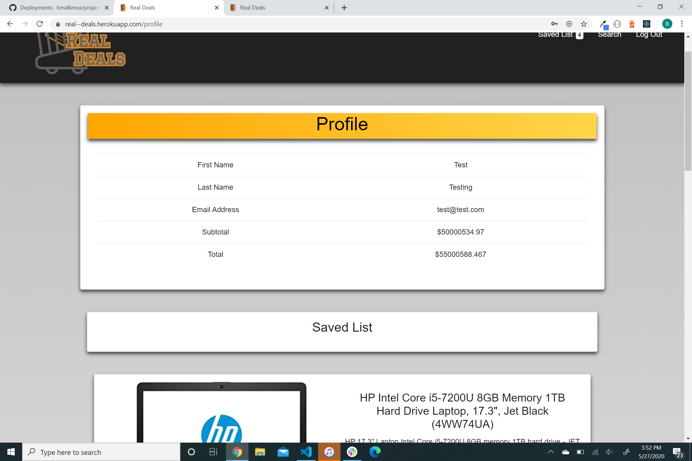

# Project_3
# Real Deals

## Description
&nbsp;&nbsp;&nbsp;&nbsp;Our app, Real Deals, is designed to help our users to search multiple website platforms to find the cheapest price.   
&nbsp;&nbsp;&nbsp;&nbsp;This App uses BarcodeSpider API to search multiple website platforms for prices on products given the users search terms. The user then can choose which platform they would like to order the product from and then save it to their profile/saved list. On the users profile, they can view which products they have saved, can decide which products they would like to remove from the list, and can view the total dollar amount of the combined products. Each profile page is user specific.    
 
Register Page 
 
 
Login Page   
  
Search Page    
 
User Profile

## Usage
https://real--deals.herokuapp.com/  
Register and Login in to reach the search landing page. 

## Acknowledment
Authors: 
* Ruonan Yang  
* Skyler Tosh  
* Albert Chen  
* Ben Malkmus   

Built with: 
* Create React App 
* Axios 
* Barcode Spider API  
* React-Bootstrap Component Library  
* MySQL npm  
* MySQL 2 npm  
* Cors npm  
* jwt-decode  
* jsonwebtoken  
* Express.js  
* Bcrypt npm  
* Sequelize 

Logo: 
* logomakr.com

## License
This project is licensed under the MIT License.
